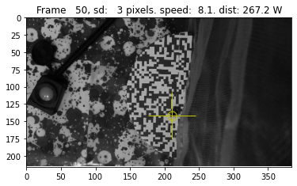

# beewalkvideotrack
Tracks bee walking route in top down videos



# Requirements

For the tracking component you will need:
- numpy
- opencv-python

To use the gettracksummarydataframe method, you will need:
- pandas

For rendering to a file you will also need
- moviepy

Install with, for example:
`pip install moviepy`

# Install

To install this module, run:

```
pip install git+https://github.com/lionfish0/beewalkvideotrack.git
```

# Commandline usage

```
usage: beetrack [-h] [--suffix SUFFIX] [-r] [--recordfile RECORDFILE] [-s] videofn [videofn ...]

Find route bee walks in video(s). Example: beetrack data/*.mp4

positional arguments:
  videofn               Video filename

optional arguments:
  -h, --help            show this help message and exit
  --suffix SUFFIX       For output videos the suffix to use
  -r                    Whether to output to a video file.
  --recordfile RECORDFILE
                        CSV file to append with (filename,distance) tuple
  -s                    Whether to append distance walked to record file.
```

## Example commandline

Render to a file (default with suffix '_track')
```
beetrack data/*.mp4 -r
```

Record to a CSV (default name, summarywalkdist.csv)
```
beetrack *.mp4 -s
```

# Python import

To use in your python code, see the [demo notebook](https://github.com/lionfish0/beewalkvideotrack/blob/main/jupyter/Demo.ipynb).
